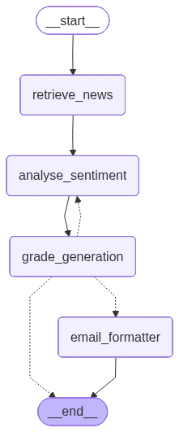

# SentimentRadar

In this project, we built a self-reflective, agentic AI system that uses chain-of-thought reasoning to analyze large volumes of online news articles and generate a concise summary of the overall market sentiment for a given asset. As an investor, I’ve always relied on news to build a solid fundamental understanding of the assets I am interested in. However, due to increasing work commitments, I’ve had less time to keep up. To address this, I decided to develop an AI system that can condense sentiment from multiple news sources into a few concise paragraphs—making it much quicker and easier for me to stay informed. These are the assets I am mainly focused on in this project:

- **Cryptocurrency**: Bitcoin, Ethereum, Ripple, Binance Coin, Solana and Chainlink
- **Stocks**: Nvidia, Meta, Tesla, Palantir, Microsoft, Google

## Project Structure

Below is an overview of the project's structure, highlighting the most important files and their roles:
```bash
/src/
├── prompts/
    ├── analyse_sentiment.py            # System prompt for analyzing market sentiment from news articles
    ├── email_formatter.py              # System prompt for formatting the report into an HTML newsletter
    └── grade_generation.py             # System prompt for evaluating the groundedness and usefulness of the report
├── components/
    ├── analyse_sentiment.py            # Node for analyzing market sentiment
    ├── email_formatter.py              # Node for formatting the sentiment report into a weekly HTML newsletter
    ├── grade_generation.py             # Router for assessing groundedness and usefulness, and directing flow accordingly
    ├── retrieve_news.py                # Node for retrieving news articles relevant to the given asset
    └── schemas.py                      # Defines Pydantic models for graph state and structured output schema
├── graph_constructor.py                # Connects all nodes to form the agentic AI system
├── mapper.py                           # Returns the appropriate class to instantiate depending on the arguments passed.
├── generate_reports.py                 # Entry point for running the self-reflective agentic AI system

/config/
└── settings.yaml                       # Configuration file specifying the LLM model and targeted assets
```

## Methodology

This section provides a technical overview of the architecture of our AI system, as illustrated in the diagram below. In brief, when a specific asset is selected, the system fetches relevant news articles from the internet via API calls. The content is then analyzed by a generator model to produce a market sentiment report for that asset.

A critic model subsequently evaluates the generated report. If the report is deemed insufficient, the critic produces a list of actionable criticisms, which the generator model uses to improve and regenerate the report. On the other hand, if the report meets the quality standards, it is formatted into an HTML-based weekly newsletter and sent via email to the intended recipients. Both the generator and critic models use `gpt-4.1-mini`.

<p align="center">
    
</p>

### Retrieve News Articles

In this node, we retrieve relevant news articles related to a given asset from the internet, using sources that are specific to finance. Specifically, news is fetched via API calls from three platforms: Yahoo Finance (yfinance), TradingView, and Finviz. For cryptocurrencies, only yfinance and TradingView are used, as Finviz does not provide news coverage for these asset types. In contrast, for stocks, all three sources are utilized.

For each source, the retrieved articles are sorted by their publication date and filtered to include only those published within the past week. After collecting the articles, we merge the results from all sources and remove duplicates. To identify duplicates, we assume each article is uniquely defined by its URL and we filter out any articles with duplicate links.

Chunking was unnecessary during retrieval because the `gpt-4.1-mini` model supports a large context window of approximately 1,000,000 tokens, allowing all retrieved articles to be processed together without issue. Moreover, the retrieved articles are typically all relevant to the target trading asset, so they should all be included as part of the summarisation.

### Analyse Market Sentiment

After retrieving the relevant news articles, we analyzed them to assess the market sentiment for the given asset and generate a comprehensive report detailing both the current sentiment and any projected future trends (if applicable). The report includes citations referencing the specific news articles used in the analysis, ensuring that the information is traceable and verifiable.

To perform the sentiment analysis, we employed a chain-of-thought reasoning approach with structured output. In this method, the `gpt-4.1-mini` generator model is prompted to first reason through the task, outlining a series of logical steps used to analyse sentiment using the content of the provided news articles. Each step in the chain represents a discrete reasoning task and the result derived from applying that task to the input data.

The structure of this process is captured using the following Pydantic models:

```python 
class Step(BaseModel):
    """
    A Pydantic model representing a single step in a chain of thought.
    Each step includes a description of the reasoning step and its corresponding output.
    """
    description: str = Field(...,  description="A brief explanation of the reasoning step taken.")
    output: str = Field(...,  description="The result or conclusion derived from this reasoning step.")

class Report(BaseModel):
    """
    A Pydantic model representing a structured market sentiment analysis report
    generated from a list of provided news articles.
    """

    chain_of_thought: List[Step] = Field(
        [],
        description=(
            "A sequence of reasoning steps representing the structured approach "
            "used to analyze the provided news articles."
        ),
        min_length=1,
    )

    report: str = Field(
        '',
        description=(
            "A detailed analytical report describing the current and, if applicable, "
            "future market sentiment of the asset, strictly grounded in the chain-of-thought reasoning."
        ),
    )

    current_sentiment: Literal[
        'Strongly Negative', 'Negative', 'Neutral', 'Positive', 'Strongly Positive'
    ] = Field(
        '',
        description="The concluded current market sentiment based on the analysis presented in the report.",
    )

    future_sentiment: Optional[
        Literal['Strongly Negative', 'Negative', 'Neutral', 'Positive', 'Strongly Positive']
    ] = Field(
        None,
        description="The projected future market sentiment, if applicable, based on the report.",
    )

    citations: List[int] = Field(
        [],
        description="A list of integer IDs referencing the news articles that support the report’s conclusions.",
    )
```

By default, `gpt-4.1-mini` generates structured output according to the order of fields in the schema. We arranged the fields to ensure the model produces output in the intended sequence: first the chain-of-thought, followed by the analytical report. After the report is generated, the model concludes the current and projected (if applicable) market sentiment, and finally lists the citations supporting the report.

Maintaining this field order is essential for preserving the logical progression of reasoning, analysis, and conclusion within the structured output. If the fields are not carefully ordered, the generation process can disrupt the intended reasoning flow—for example, producing the chain-of-thought after the report would render it ineffective, since the report relies on the chain-of-thought for guidance.


### Self-Reflection


After generating the sentiment report, we perform a self-reflection step that evaluates two key dimensions: groundedness and usefulness. Groundedness measures whether the report’s content is actually supported by the news articles it cites, while usefulness assesses whether the report provides meaningful insights into the current and projected (if applicable) market sentiment for the asset.

Each assessment produces a boolean outcome: `True` or `False`. A `True` indicates that the report is grounded and/or useful, whereas a `False` suggests the report either contains hallucinated information or fails to provide valuable insight. If the report is found to be hallucinated or does not provide insight on the sentiment(i.e., not grounded/useful), the critic model generates a list of criticisms detailing how to improve the report for greater factual accuracy and usefulness. These criticisms are then passed back to the generator model to guide the re-generation of the report.

Both evaluations use a chain-of-thought reasoning with structured output to analyze the report. For groundedness, the expected behavior is for the critic model to examine each claim in the report and assess whether it is supported by evidence from the cited sources. For usefulness, the critic model is expected to determine whether the report meaningfully discusses both current and projected market sentiment.

```python
class GroundednessOutput(BaseModel):
    """
    A Pydantic model for assessing whether a market sentiment report is factually grounded 
    in the news articles it references. 

    If the report is **not factually grounded**, provide a list of specific criticisms 
    explaining how to improve its factual grounding based on the referenced news articles.
    """
    chain_of_thought: List[Step] = Field(
        ...,
        description=(
            "A structured sequence of reasoning steps used to evaluate the factual grounding "
            "of the report with respect to the referenced news articles."
        ),
        min_length=1
    )
    is_grounded: bool = Field(
        ...,
        description=(
            "Indicates whether the report is factually grounded in the referenced articles, "
            "as determined through the chain-of-thought reasoning."
        )
    )
    criticisms: Optional[List[str]] = Field(
        ...,
        description=(
            "If the report is not grounded, provide a list of specific, actionable criticisms "
            "explaining how to make it more factually accurate and aligned with the referenced news articles."
        )
    )


class UsefulnessOutput(BaseModel):
    """
    A Pydantic model for evaluating whether a market sentiment report effectively addresses 
    the current market sentiment and, where relevant, the anticipated future sentiment.

    If the report **does not effectively address** the current or future market sentiment, 
    provide a list of specific criticisms explaining how to improve its usefulness.
    """

    chain_of_thought: List[Step] = Field(
        ...,
        description=(
            "A structured sequence of reasoning steps used to evaluate how well the report "
            "addresses current and potential future market sentiment based on its content."
        ),
        min_length=1
    )
    is_useful: bool = Field(
        ...,
        description=(
            "Indicates whether the report effectively covers the current and, if applicable, "
            "future market sentiment, as determined through the chain-of-thought reasoning."
        )
    )
    criticisms: Optional[List[str]] = Field(
        ...,
        description=(
            "If the report is not useful, provide a list of specific, actionable criticisms "
            "explaining how to make it more relevant and aligned with market sentiment."
        )
    )
```

### Email Formatting

We proceed to the email formatting node only if the report has been assessed as both useful and grounded. In this node, the report is formatted into an HTML-based weekly newsletter that will be sent to the recipients. The newsletter includes clearly defined sections such as an introduction, conclusion, and references. To guide the model in producing the desired format, we provide few-shot examples of the expected HTML newsletter structure, encouraging it to generate content that closely follows the provided templates.


## Installation & Project Setup

This section provides instructions on how to install and set up the project locally. Before you begin, please ensure you have the following prerequisites:

1. `uv` and `Docker` installed on your system.
2. A valid `OPENAI_API_KEY` for accessing `gpt-4.1-mini`.
3. A Gmail account for sending emails.

Steps to Run the Agentic AI System <u>Every Friday at 17:30</u>:

1. Create a virtual environment with the neccessary packages using `uv sync --all-extras`.
2. Create a `.env` file in the root directory of the project.
3. Add your credentials to the `.env` file in the following format:
```
OPENAI_API_KEY=<openai_api_key>
GMAIL_PASSWORD=<gmail_password>
GMAIL_ADDRESS=<gmail_address>
```
4. Run the command: `docker build -t sentiment_radar .`
5. Run the command: `docker run sentiment_radar`

